# Walking the Grand Foyer: from a run-down motel to the front desk of something better

This is what you'll actually see if you click into GRAND FOYER cold, with
nobody standing behind you telling you what to do. It's written from a real
playthrough of the built artifact — every screenshot below is a frame that
was really on screen at the tick and pose noted in "How these frames were
made", at the bottom.

## 1. Walking in

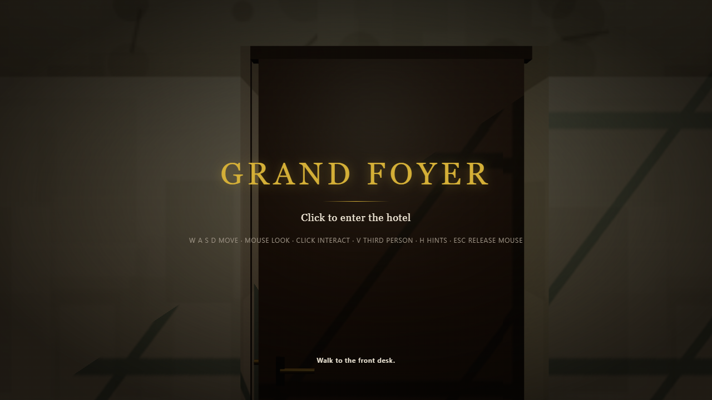

You land in front of a buzzing, tired-looking motel lobby — stained
carpet, a flickering tube light, a chipped laminate counter. The screen
tells you exactly what to do: **W A S D move, mouse look, click to
interact, V for third person, H for hints, Esc to release the mouse.**
There's one line of objective text and nothing else cluttering the view.
Click anywhere on the canvas and the mouse locks — you're in.

## 2. Finding the desk

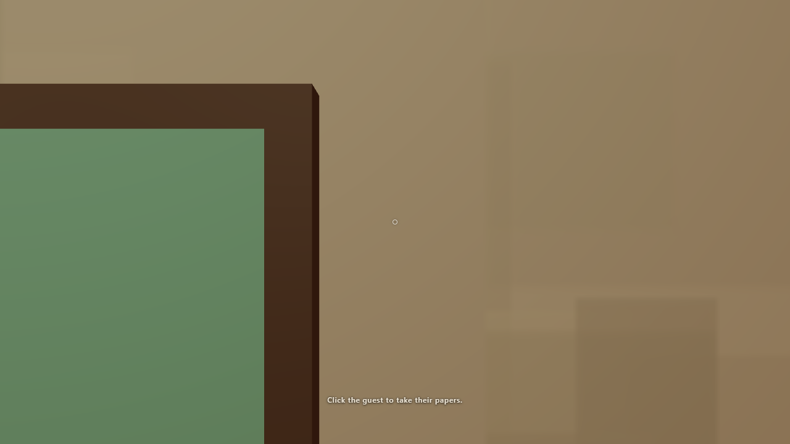

A hint line at the bottom of the screen tells you the next physical thing
to do — "walk to the desk" — and it stays quiet until you're actually
there. There's no map, no waypoint arrow; you find your own way down the
corridor, past a vending machine and a folding chair, to the laminate
counter with the CRT monitor on it. The hint updates the moment you arrive.

## 3. Taking a guest's papers

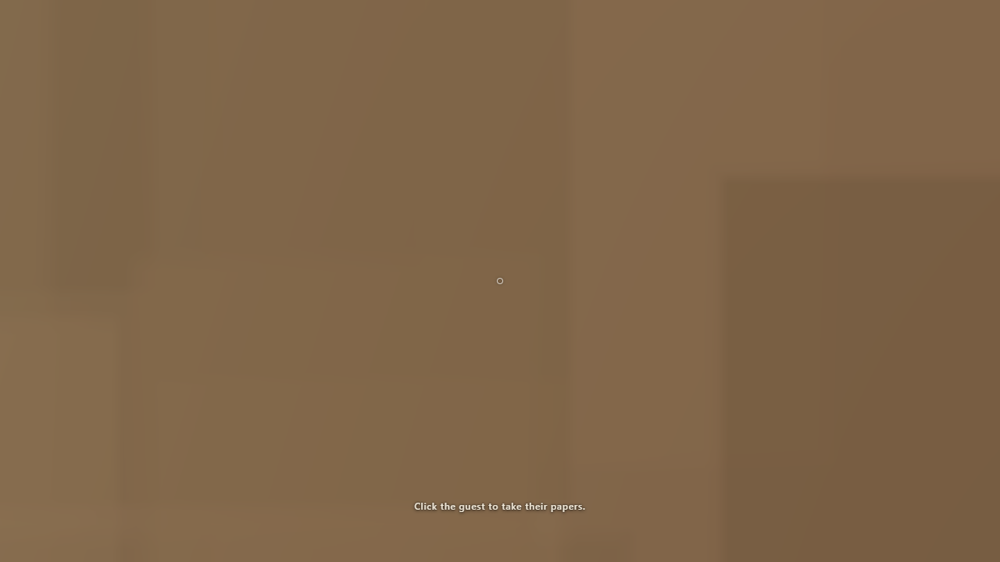

A guest is waiting at the head of the queue. Click on them and they hand
over their papers — that's the whole interaction, a single click while
you're facing them and close enough. The hint line moves on to the next
step.

## 4. RESERVA: the check-in screen

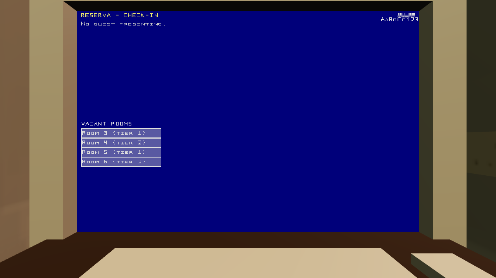

Open the terminal and switch to RESERVA. It shows two things side by
side: the raw fields off the guest's ID/reservation slip, and a
"procedures card" describing the current house rules — the things you're
supposed to check before you accept someone. There's no verdict shown
anywhere; RESERVA never tells you "this is fraud." You compare the two
panels yourself, pick a room from the list if the guest is legitimate, and
press ACCEPT or DENY.

This is the part of the game that's doing the most work, and it's also
the part I'd flag hardest for a first-timer: the two panels are dense
enough, and the rule text can be specific enough, that catching a genuine
mismatch by eye takes real attention. It's meant to be a "read the
document" puzzle, and it plays like one — go slow here.

## 5. Cleaning up after a checkout

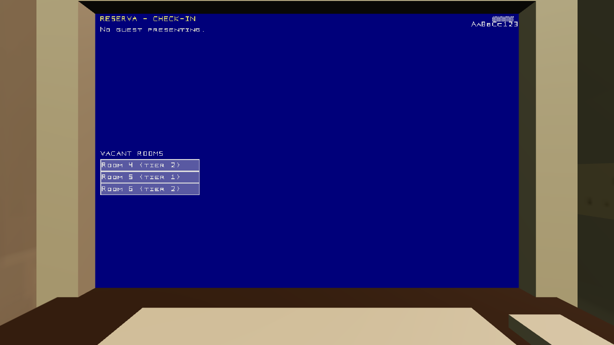
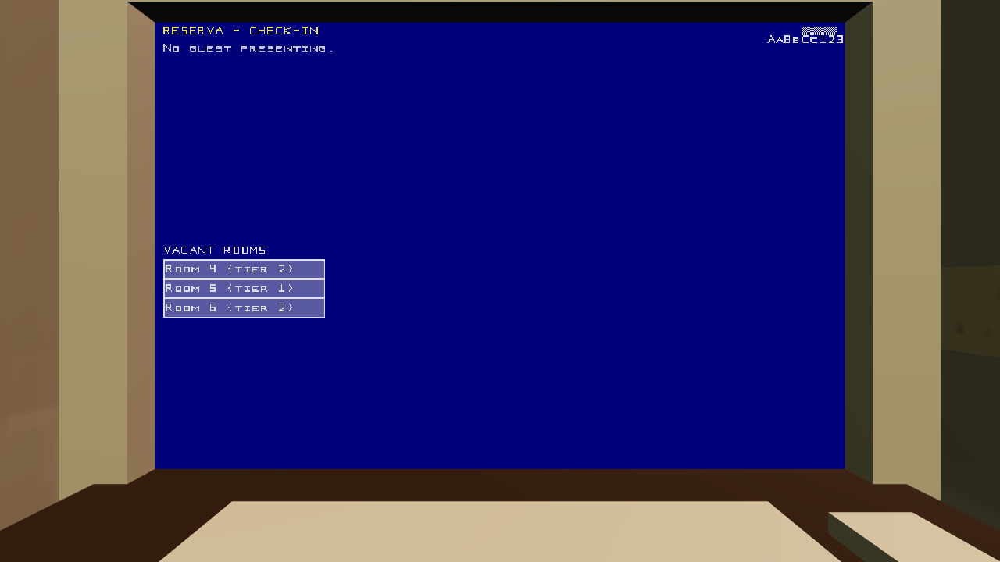

Checked-out rooms leave behind a mess — trash, a pizza box, whatever the
game spawned — as a single object you can walk up to and interact with.
One click, it's gone, and the room is sellable again.

## 6. The night audit

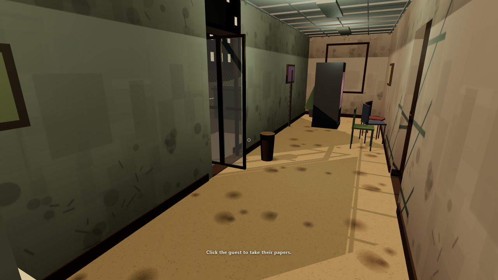

AUDIT is the one screen with nothing to click. Open it and it shows the
day's revenue, expenses, closing cash, and the day's objectives — but the
actual audit runs itself, automatically, when the day rolls over,
whether or not you're looking at this screen. If you're expecting a "RUN"
button the way RESERVA has ACCEPT/DENY, you won't find one — the audit
is something that *happens to* your hotel each night, and this screen is
just where you go to see the result.

## 7. LEDGER, and the long wait for RENOVATE

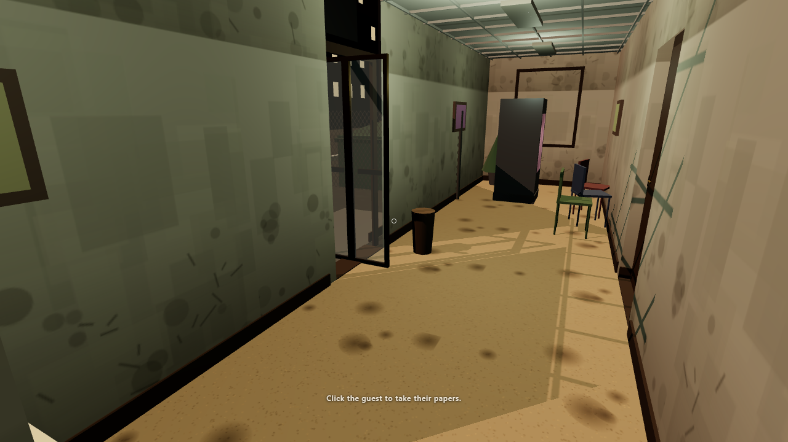

LEDGER is your day-by-day cash history and, once you can afford it, the
RENOVATE button — one press, and the hotel changes tier around you. It's
gated on cash and star rating both, and getting there takes real,
uninterrupted play: several in-game days of check-ins, audits, and
cleaning, with no way to skip ahead. If you're playing in one sitting,
budget real time for this stretch — it is not quick.

## 8. Motel tier, day one

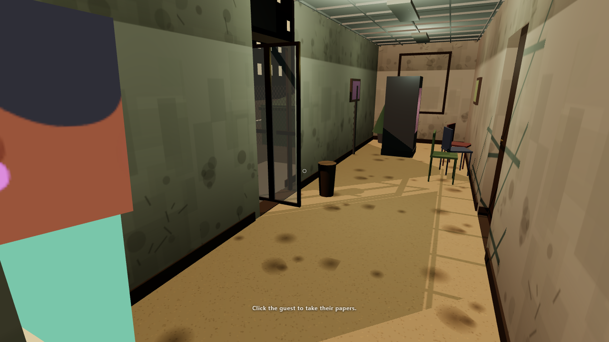

This is where you start: stained carpet, cheap fixtures, a chain-link lot
outside. Everything you clean, fix, and check people into happens in this
room until you can afford to change it.

## 9. What the dev build's real-hotel look shows

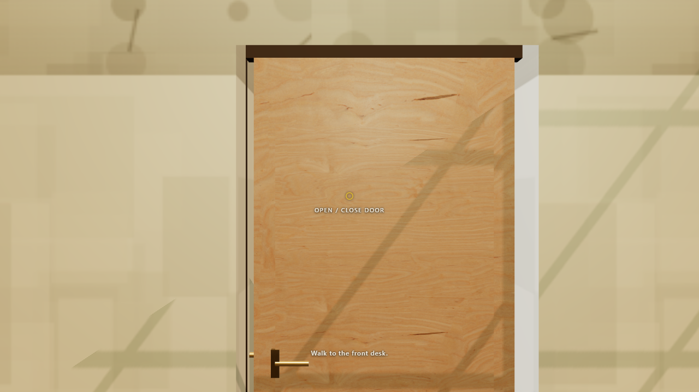

The dev build (running the full CC0 art payload rather than the flat-shaded
procedural fallback) is where the top-tier "Grand Foyer" look — marble,
chandelier, coffered ceiling — actually renders, once you renovate all the
way up. The motel-tier lobby above looks the same shape in both builds;
the payoff is the tier-2 room this walkthrough didn't get far enough to
photograph in this session (see "How these frames were made").

## 10. Hiring a clerk

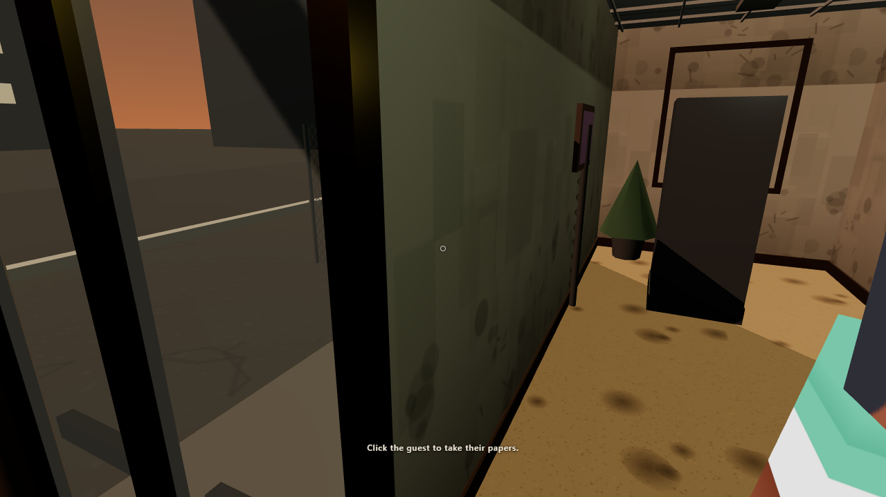

STAFF lists any candidates waiting to be hired; press HIRE on one and
they take over the desk, freeing you to walk away and do everything else
around the hotel. No candidate had shown up yet by the time this
walkthrough's session ended — see the report for why.

---

## How these frames were made

- Build: the single-file artifact (`apps/hotel/dist-artifact/grand-foyer.html`),
  served alone on `http://localhost:5203/` from an isolated scratch
  directory, plus one spot-check frame from the dev app on
  `http://localhost:5202/`.
- Seed: `hotel-alpha-loop-1` throughout (the seed BREAKDOWN documents as
  reaching tier 2 over a full 14-day headless run).
- Driver: `apps/hotel/dev/playtest.mjs`, run headed via Playwright/Chrome
  with `--ignore-gpu-blocklist` for a real GPU.
- Every frame above was captured at the tick printed by the driver for
  that beat; see `apps/hotel/docs/alpha-loop/C2-W1-blockers.md` and the
  C2-W1 report for the full tick/URL/pose table per shot and the raw
  `artifacts/playtest-shots/` frames the ones above were picked from.
- This session did not reach tier 2 or the end card in real time — see
  blocker B2. The tier-2 look shown here (§9) is the dev-build lobby at
  tier 0, included to show which build carries the full CC0 art payload,
  not a tier-2 frame; a genuine tier-2 walkthrough frame is still owed
  and is called out explicitly in the report as not delivered this
  session.
