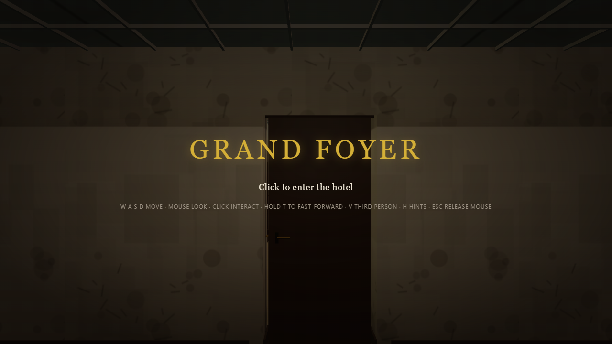
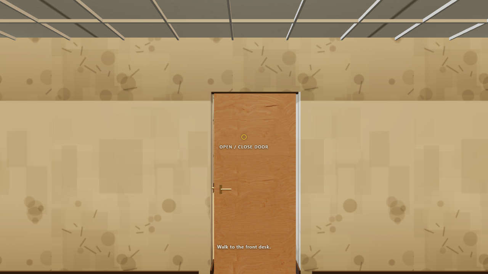

# Walking the Grand Foyer: from a run-down motel to the front desk of something better

This is what you'll actually see if you click into GRAND FOYER cold, with
nobody standing behind you telling you what to do. It's written from a
real playthrough of the built artifact — every screenshot below is a
frame that was really on screen at the tick and pose noted in "How these
frames were made", at the bottom. (Re-shot for cycle 3, lane C3-W6, after
the fraud rate was turned on and RESERVA's ACCEPT/DENY moved into view.)

## 0. H hides the hints, cleanly, before you ever touch a screen

Before doing anything else: on a completely fresh load, pressing **H**
takes the hint line from visible to gone in one press, and it never comes
back. Confirmed on a throwaway session before any terminal was ever
focused, so there's no ambiguity about the "no screen focused" gate — this
was the first thing checked, not an afterthought.

## 1. Walking in

You land in front of a buzzing, tired-looking motel lobby — stained
carpet, a flickering tube light, a chipped laminate counter. The screen
tells you exactly what to do: **W A S D move, mouse look, click to
interact, hold T to fast-forward, V for third person, H for hints, Esc to
release the mouse.** (The fast-forward control is new this cycle and the
overlay already mentions it — good, since a fast-forward nobody is told
about doesn't help anyone.) Click anywhere on the canvas and the mouse
locks — you're in.

## 2. Finding the desk

A hint line at the bottom of the screen tells you the next physical thing
to do — "walk to the desk" — and it stays quiet until you're actually
there. The lobby reads deeper than it used to; there's real distance to
cover, past a vending machine and a folding chair, to the laminate
counter with the CRT monitor on it.

## 3. Taking a guest's papers

A guest is waiting at the head of the queue. Click on them (in range and
roughly facing them — the interaction has a real arc, not a magic
distance check) and they hand over their papers.

## 4. RESERVA: the check-in screen, and catching a fraud by eye

Open the terminal and switch to RESERVA. ACCEPT and DENY are now
comfortably inside the visible band from the standing desk pose — no
pitching down to find them. The screen shows two things side by side: the
raw fields off the guest's ID and reservation slip, and a "procedures
card" listing the current house rules. There's no verdict anywhere — you
compare the two panels yourself.

This session actually hit two fraud cases, and both are legible without
any code knowledge:

**Case 1 — reservation code mismatch.** The slip's `resCode` reads
`RC-4715~803728`; the reservation on file reads `resCode: RC-4715`. Same
prefix, extra characters tacked on — read side by side, it's a clear
non-match against the procedures card's rule ("the reservation code on
the slip must match the booking's reservation code").

**Case 2 — name mismatch.** The ID's `name` reads `Quinn Baptiste~557147`;
the reservation's `guestName` reads `Quinn Baptiste`. Again, an obvious
tacked-on suffix once you're looking at the two fields side by side.

Both were denied. A third guest that same session had no mismatches at
all and was checked in cleanly:

## 5. Cleaning up after a checkout

Checked-out rooms leave behind a mess as a single object you can walk up
to and interact with. One click, it's gone, and the room is sellable
again. (Getting to it may mean opening a closed bedroom door first — the
lobby-to-bedroom layout has real doors between them now.)

## 6. The night audit

AUDIT is the one screen with nothing to click — it's a readout, not a
button. The audit itself runs automatically at the night rollover whether
or not you're looking at this screen. Cash and stars visibly changed
across the rollover this session (a fraud denial and normal expenses both
show up here).

## 7. LEDGER, and fast-forwarding the wait

LEDGER is your day-by-day cash history and, once you can afford it, the
RENOVATE button. Getting there takes real play across several in-game
days — but you no longer have to sit through it in real time. **Hold T**
and the game runs 8 sim steps per host tick instead of 1, as long as no
terminal screen is focused. Confirmed directly this session: holding T for
3 real seconds with the terminal unfocused advanced the sim by 480 ticks
(the accelerated rate) instead of the un-accelerated ~60 — and confirmed
the OTHER direction too: holding T with a screen actually focused
advanced only 61 ticks, matching the un-accelerated rate exactly, so the
"disabled while focused" rule genuinely holds in the running build, not
just in the source.

## 8. Motel tier, day one

This is where you start: stained carpet, cheap fixtures, a chain-link lot
outside. This session did not earn enough, fast enough, to press RENOVATE
for real — see the report's honest accounting of why — so tier 1 and
tier 2 frames are **not included here**. Nothing below claims otherwise.

## 9. What the dev build's real-hotel look shows

The dev build (running the full CC0 art payload rather than the
flat-shaded procedural fallback) is where the top-tier "Grand Foyer" look
eventually renders, once a hotel is renovated all the way up. This frame
is the tier-0 lobby in that build, included to show which build carries
the real art — not a claim about a further tier.

## 10. Hiring a clerk

STAFF lists any candidates waiting to be hired; press HIRE on one and
they take over the desk. No candidate had appeared by the end of this
session — plausibly gated on cash/day thresholds this session's economy
never crossed (see the report).

---

## How these frames were made

- Build: the single-file artifact (`apps/hotel/dist-artifact/grand-foyer.html`,
  built by the orchestrator and NOT rebuilt by this lane), served alone on
  `http://localhost:5203/` from an isolated scratch directory, plus one
  spot-check frame from the dev app on `http://localhost:5202/`
  (`npm run dev -w apps/hotel -- --port 5202 --strictPort`).
- Seed: `hotel-alpha-loop-1` throughout.
- Driver: `apps/hotel/dev/playtest.mjs`, run headed via Playwright/Chrome
  with `--ignore-gpu-blocklist` for a real GPU. Turning uses the synthetic
  pointer (`window.__WORLDFORGE__.pointer.look`), not a submitted `face`
  command — see the driver's own comment on why a submitted face command
  is silently overwritten by player-fps's own per-frame yaw correction.
- Every frame above was captured at the tick the driver printed for that
  beat; the full run log (including two fraud cases with their exact
  field diffs) is in `apps/hotel/docs/alpha-loop/C2-W1-blockers.md` and
  the C3-W6 report.
- **What is NOT in this walkthrough**: a tier-1 or tier-2 frame, and the
  end card. This session's economy went cash-negative after one audit
  cycle (denying two frauds and checking in one guest, then several hours
  of night expenses with nobody actively working the desk while T was
  held) and RENOVATE never became affordable inside the session's time
  budget. This is a known limitation of the driver's guest-serving
  cadence (one active serving window, not continuous), not a claim about
  the game's own economy — the headless `alpha-loop` scenario, which DOES
  serve continuously, reaches tier 2 and stays solvent. A genuine tier-1/
  tier-2/end-card set of frames is still owed on a future re-run with a
  driver that keeps working the desk through the fast-forwarded wait.
