# Walking the Grand Foyer: from a run-down motel to the front desk of something better

This is a player's guide to GRAND FOYER's alpha loop, cold, with nobody
standing behind you telling you what to do. The entry-through-audit frames
below are real screenshots from a real playthrough of the built artifact.
The tier-1, tier-2 and end-card frames are real renders of the actual
scene and HUD code, taken via the dev tools (the tour page and HUD
harness), not a live playthrough that reached them — see "How these
frames were made", and each such frame's own caption says so again.

## Controls

- **W A S D** — move
- **Mouse** — look (pointer-lock free-look; click the canvas once to lock
  the mouse, then just look around — never click-drag)
- **Click** — interact with whatever's under the reticle (guest, door,
  mess, terminal, broken prop)
- **Hold T** — fast-forward the sim 8x, as long as no terminal screen is
  focused (snaps back to normal the instant you focus a screen)
- **H** — hide the on-screen hint line (one-way for the session)
- **V** — toggle third person · **Esc** — release the mouse
- **F5 / F9** — save / restore your game (browser `IndexedDB`)

## 1. Walking in

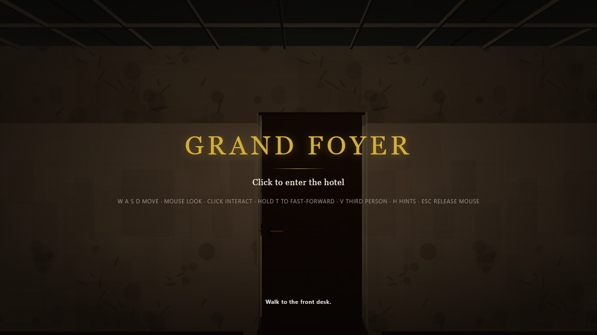

You land in front of a buzzing, tired-looking motel lobby — stained
carpet, a flickering tube light, a chipped laminate counter. The entry
overlay lists the controls above in one line. Click anywhere on the
canvas and the mouse locks — you're in.

## 2. Finding the desk

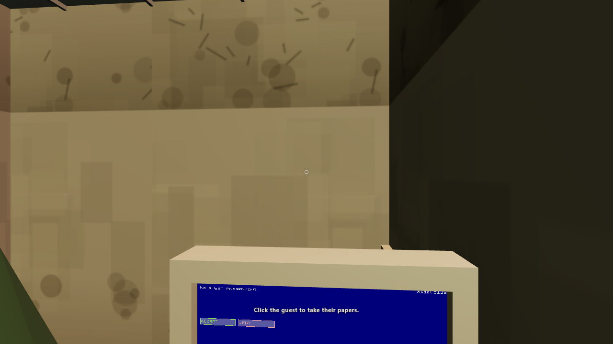

A hint line at the bottom of the screen names the next physical thing to
do — "walk to the desk" — and stays quiet until you're actually there.
Steps advance from what you do, not from a timer.

## 3. Taking a guest's papers

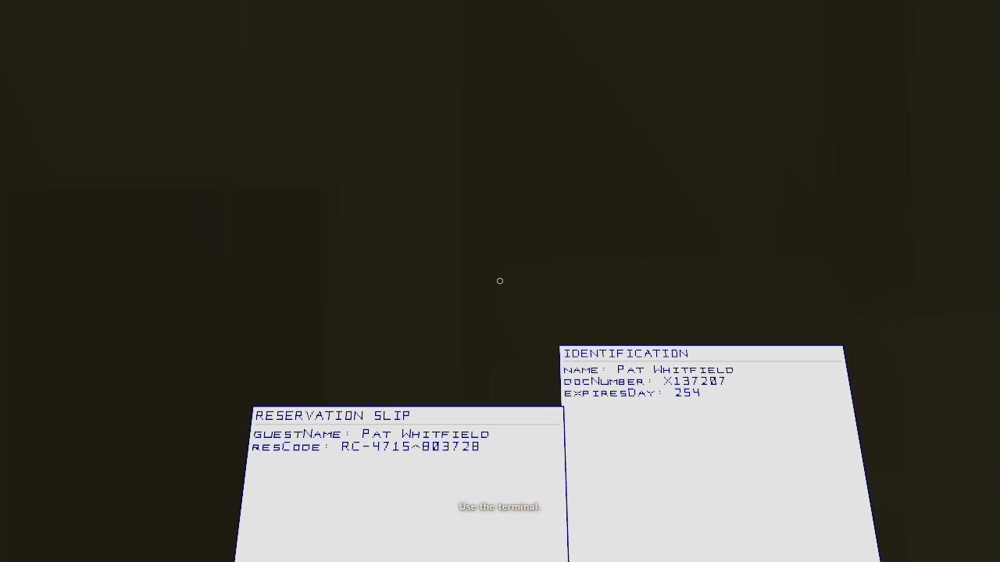

A guest waits at the head of the queue. Click on them — in range and
roughly facing them, not a magic-distance check — and they hand over
their papers.

## 4. RESERVA: the check-in screen, and catching a fraud by eye

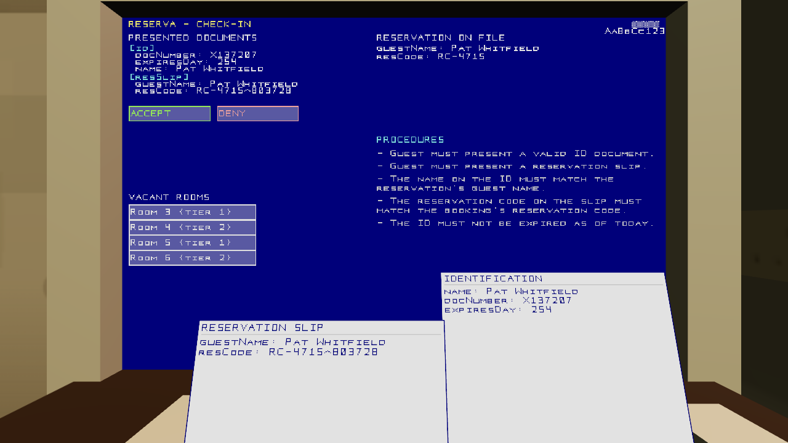

Open the terminal and switch to RESERVA. It shows two things side by
side: the raw fields off the guest's ID and reservation slip, and a
"procedures card" listing the current house rules. There's no verdict —
you compare the two panels yourself and press ACCEPT or DENY.

Two real fraud cases from this build's playthrough, both legible without
any code knowledge:

**Case 1 — reservation code mismatch.** The slip's `resCode` reads
`RC-4715~803728`; the reservation on file reads `resCode: RC-4715`. Same
prefix, extra characters tacked on — a clear non-match against the
procedures card's rule.

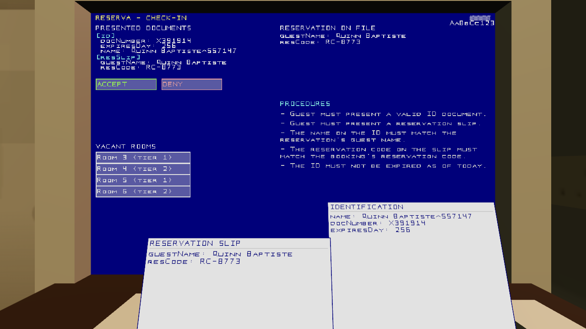

**Case 2 — name mismatch.** The ID's `name` reads `Quinn Baptiste~557147`;
the reservation's `guestName` reads `Quinn Baptiste`. Same pattern, the
other field.

Both were denied. A third guest that same session had no mismatches and
was checked in cleanly:

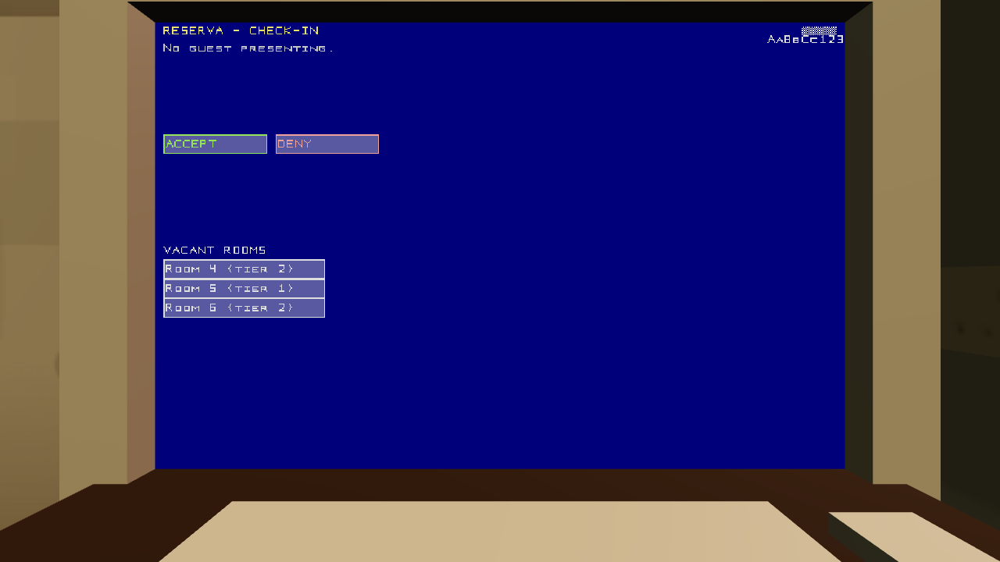

**If you miss one:** a fraudulent guest you accept pays nothing at
checkout — the stay's charge comes back as a chargeback against your own
cash, and the hotel takes a reputation hit in that guest's segment
equivalent to one 1-star review. Catching it costs you nothing extra;
missing it costs real cash and a star.

## 5. Cleaning up after a checkout

Checked-out rooms leave a mess as a single object you walk up to and
interact with. One click, it's gone, and the room is sellable again.
(You may need to open a closed bedroom door first to reach it.)

## 6. The night audit

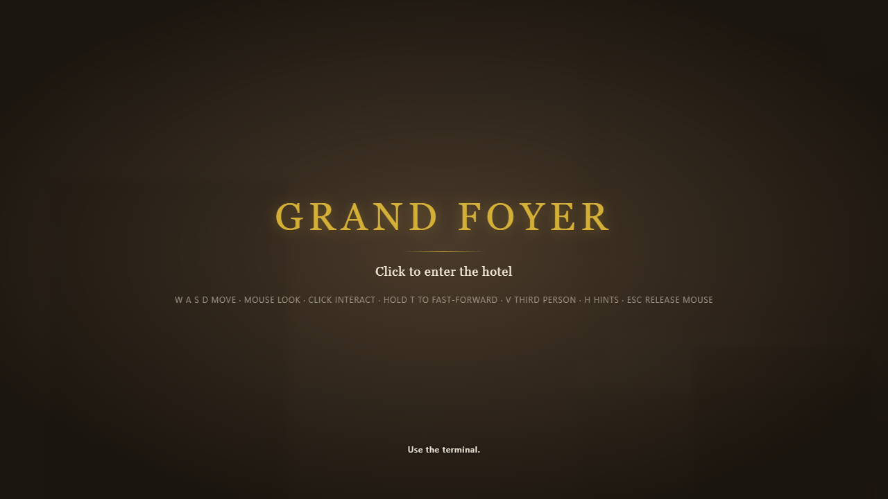

AUDIT is a readout, not a set of buttons — the audit runs itself
automatically at midnight, whether or not you're looking at this screen.
Cash and stars visibly change across the rollover; a fraud denial and the
night's normal expenses both show up here.

## 7. LEDGER, and fast-forwarding the wait

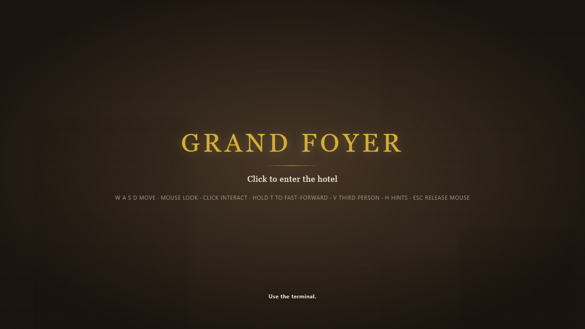

LEDGER is your day-by-day cash history and, once you can afford it, the
RENOVATE button. Getting there takes real play across several in-game
days, but you don't have to sit through it in real time — **hold T** and
the sim runs 8 steps per host tick instead of 1, as long as no terminal
screen is focused.

## 8. The economy arc: what a competent desk looks like

These numbers come from the headless `alpha-loop` bot — the same
desk/hire/clean/repair/rate loop a player works, run by a bot that keeps
serving the desk instead of just waiting. Re-derived directly from
`scenarios/alpha-loop.scenario.mjs` (14/14 assertions passed):<!-- re-run 2026-09-03: harness verdict 14/14 assertions passed; day figures re-derived from a direct sim run of scenarios/alpha-loop.scenario.mjs, econ.audit and hotel.renovated event log -->

- **Tier 0 → Tier 1**: renovated during **day 5** (cost $800, needs 2
  stars — `RENOVATE_COST_MINOR`/`RENOVATE_STAR_REQ` in
  `src/sim/economy.ts`).<!-- apps/hotel/src/sim/economy.ts: RENOVATE_COST_MINOR = [0, 80_000, 150_000] minor units; RENOVATE_STAR_REQ = [0, 2, 2] -->
- **Tier 1 → Tier 2**: renovated during **day 9** (cost $1,500, needs 2
  stars). Cash actually dips right after — the renovation is expensive
  enough to bite before the premium (business) segment pays it back.
- **Business-segment guests** — the highest-paying kind — do not appear
  at all until after the tier-2 renovation, then keep arriving for the
  rest of the run. Tier 2 is a real unlock, not just a cosmetic reward.
- **By day 14**, the run closes solvent with cash still growing.
- **Catching fraud pays off**: this run's total fraud chargeback loss
  stayed under $100 across all 14 days, with at least one real fraud
  actually caught — the cost of a missed fraud (§4 above) is designed to
  be felt if you get sloppy.

A slower desk hits these same milestones later — the tuning target is
tier 2 by day 10 at the latest — but the shape (tier 1 first, a real cash
dip after each renovation, business guests strictly after tier 2) holds
regardless of pace.

## 9. Hiring a clerk

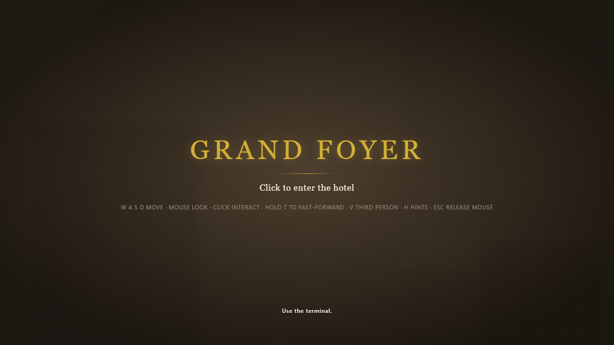

Once your cash crosses a threshold, STAFF lists candidates waiting to be
hired. Press HIRE and they take over the desk — you're no longer chained
to it, and can walk away (fast-forwarding, cleaning, repairing) while
they check guests in.

## 10. What the tiers actually look like

Motel (tier 0), day one — where every game starts: stained carpet, cheap
fixtures, a chain-link lot outside.

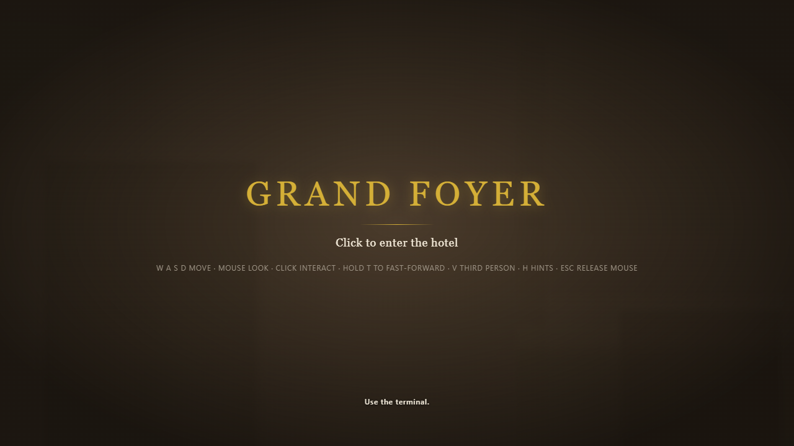

The renders below show what renovating buys you, at the same four poses
(entrance, lobby, desk, facade) per tier. **These are dev-tour renders of
the real scene at that tier, not frames from a live playthrough that
reached them — reached in play by renovating**, per each caption.

**Tier 1 — Hotel** (rendered at tier 1 via the dev tour page; reached in
play by renovating): clean carpet, painted walls with a chair rail, warm
can lighting, a wooden desk and matching furniture, an awning outside.

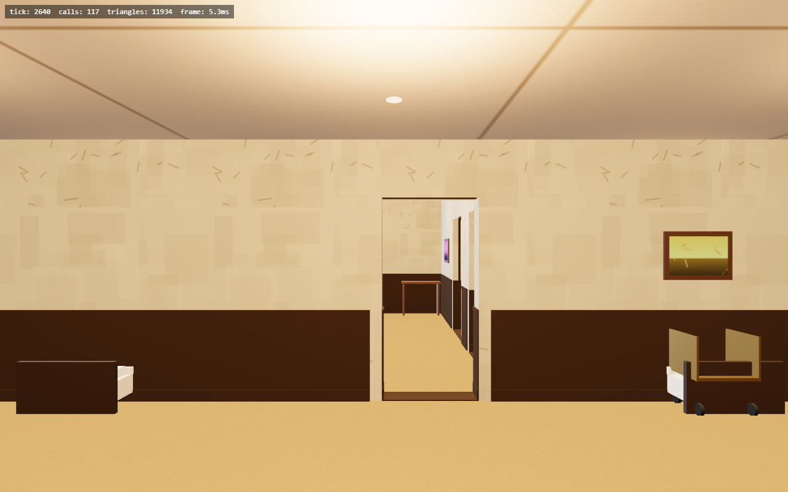
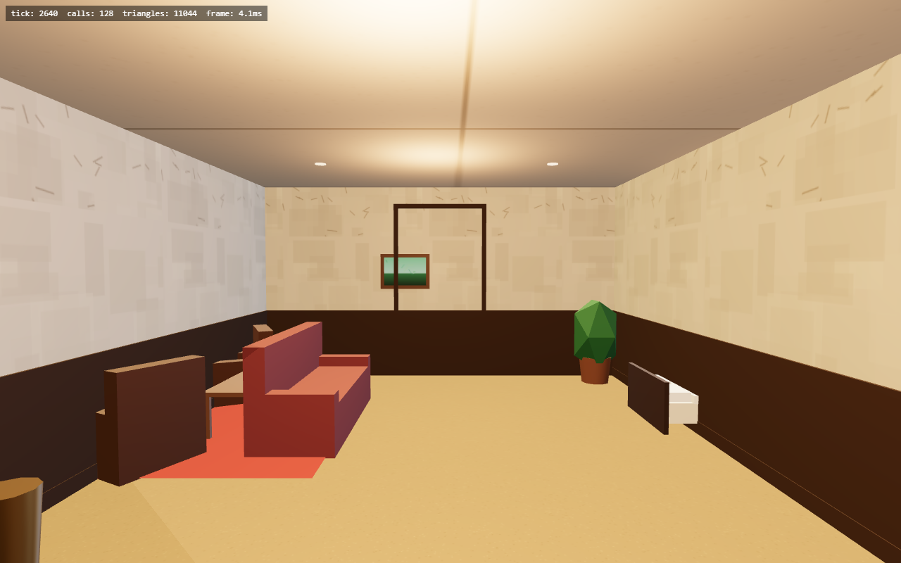
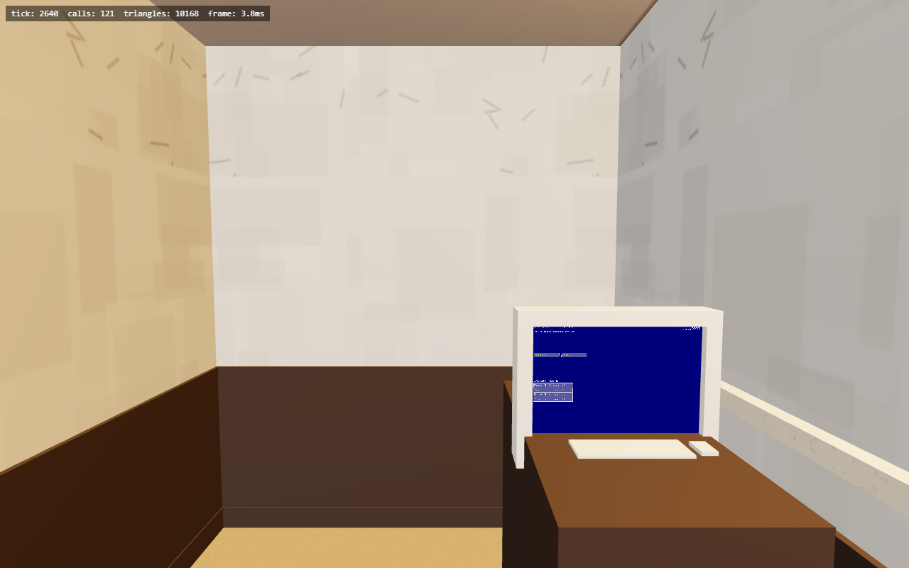
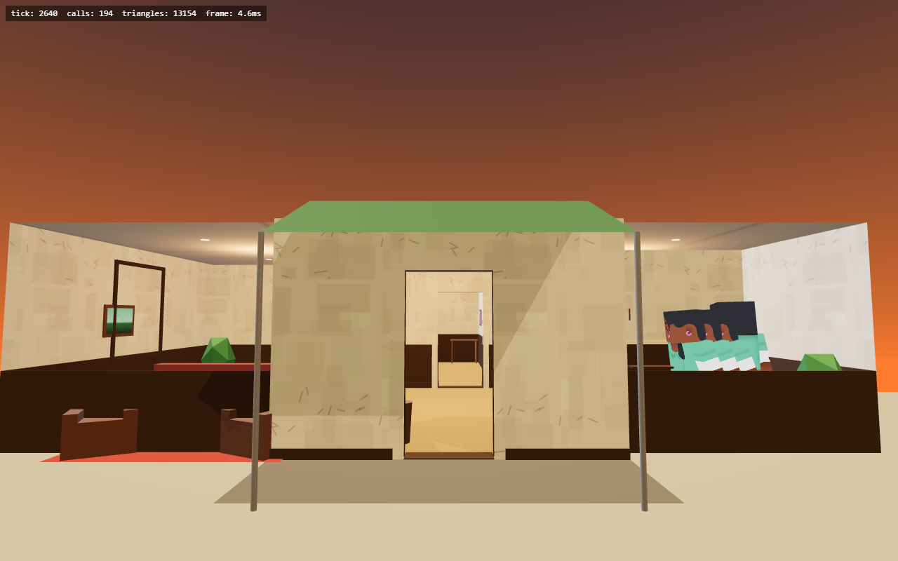

**Tier 2 — Grand Foyer** (rendered at tier 2 via the dev tour page;
reached in play by renovating): marble floor, a coffered ceiling with
exposed beams, a chandelier, gilt frames, a velvet-rope entrance under a
green awning — the payoff the tier-0 grind is aimed at.

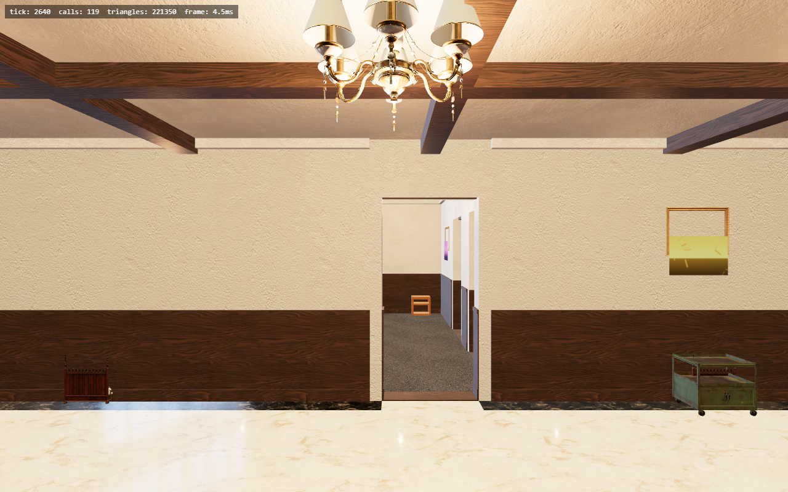
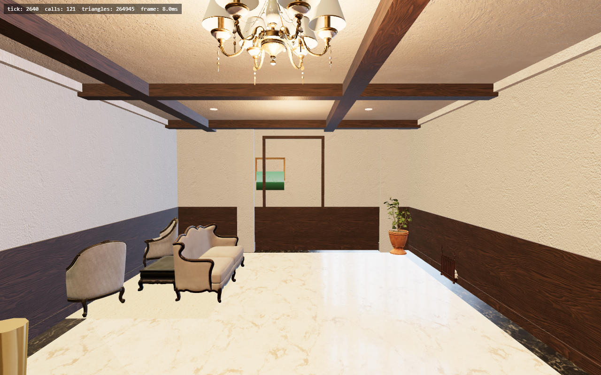
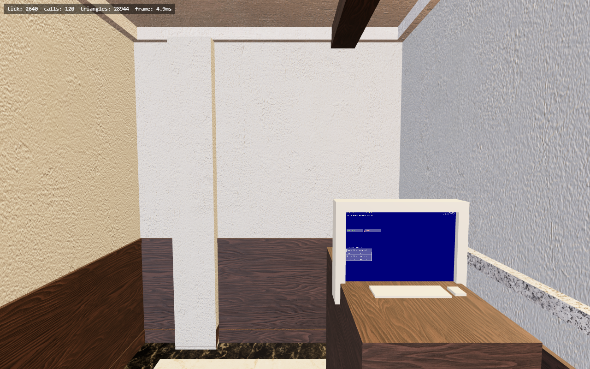
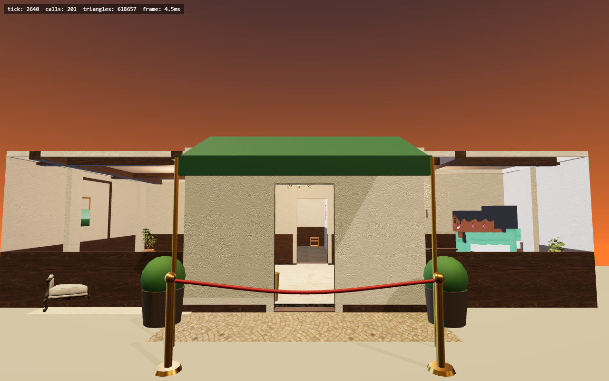

## 11. The end card, and what happens after

When the hotel reaches tier 2, an end card appears: **"The Grand Foyer
opens"**, with the day count and cash in the till at that moment.

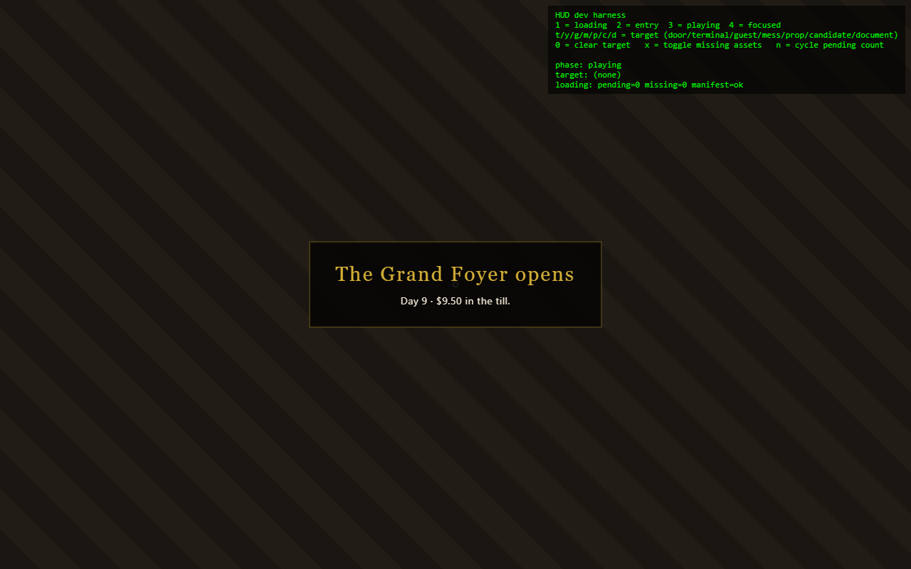

*(Rendered via the HUD dev harness, `dev/hud.html`, feeding it the same
`EndCard` shape `main.ts` builds from `walkthrough.endCard()` — see
`src/render/walkthrough.ts` and the `endcard.title`/`endcard.body` keys
in `src/render/i18n.ts` — not a live capture of the moment it fires. The
day/cash shown, 9 and $9.50, are the real values from the alpha-loop
bot's tier-2 renovation night, not placeholders.)* Dismissing it doesn't
end anything — play continues at tier 2.

## 12. Known rough edges (honest, as of this cycle)

- **No broken prop or staff candidate is guaranteed to appear early** —
  both are plausibly gated on cash/day thresholds a slow start may not
  cross.
- **A tier-2 pilaster can partially occlude the desk terminal** from some
  standing poses — a real, open issue (`docs/alpha-loop/reviews/C3-W3.md`,
  item W3-2), visible in the `tier2-desk.png` render above, not hidden.
- **Some gilt picture frames render empty** at tier 2 — a carried-forward
  rough edge, not a bug in your save.
- **A desk worked only in short bursts, not continuously, can go
  cash-negative and never reach RENOVATE** — a demonstrated limitation of
  one scripted playtest driver, not of the game's economy (the
  continuously-serving `alpha-loop` bot reaches tier 2 solvent, §8). A
  player who keeps working the desk through the T-held waits won't hit
  this.

---

## How these frames were made

- **Steps 1–7, 9** (entry through LEDGER, and STAFF): real screenshots
  from a real playthrough of the built artifact
  (`apps/hotel/dist-artifact/grand-foyer.html`), driven headed via
  Playwright/Chrome (`--ignore-gpu-blocklist`) against seed
  `hotel-alpha-loop-1` using `apps/hotel/dev/playtest.mjs`. Turning uses
  the synthetic pointer (`window.__WORLDFORGE__.pointer.look`), matching
  how a human's mouse look actually drives the sim. Full run log,
  including exact fraud field diffs, in
  `apps/hotel/docs/alpha-loop/C2-W1-blockers.md`.
- **Step 8** (economy arc): re-derived directly for this walkthrough by
  running `scenarios/alpha-loop.scenario.mjs`'s own setup and bots
  against `packages/core`'s `Sim` and reading the `econ.audit` /
  `hotel.renovated` event log — not copied from an old report. Result:
  `hotel.renovated` to tier 1 during day 5 (tick 24164), to tier 2 during
  day 9 (tick 50126), 14/14 scenario assertions passed, closing cash
  positive at day 14. Costs/star requirements read from
  `apps/hotel/src/sim/economy.ts` (`RENOVATE_COST_MINOR`,
  `RENOVATE_STAR_REQ`).
- **Step 10** (tier renders): captured from `apps/hotel/dev/tour.html`,
  which renders the real scene at a `?hotelTier=` override, served by
  `npx vite --port 5206 --strictPort`. Captured headed via
  Playwright/Chrome (`channel: "chrome"`, `--ignore-gpu-blocklist`) at
  `?worldforgeQuality=high&tick=2400`, four poses per tier — entrance
  (`x=5.375&z=2.35&yaw=0&pitch=0`), lobby-east
  (`x=3.5&z=4.4&yaw=90&pitch=2`), desk (`x=3.0&z=5.4&yaw=270&pitch=4`),
  facade (`x=5.25&z=-4&yaw=0&pitch=-4`), 12s wait per page. Real
  tier-rendering code, reached via dev override, not by renovating live —
  hence the caption on every such frame.
- **Step 11** (end card): captured from `apps/hotel/dev/hud.html`'s dev
  harness, rendering the same `createHud`/`EndCard` code `main.ts` drives,
  fed the real day/cash from the alpha-loop run above (day 9, $9.50) via
  `window.__hudDev.state.endCard` — real render path, reached through the
  dev harness rather than a live capture of the moment it first appears.
- Every image lives in `apps/hotel/docs/walkthrough/` and was checked to
  exist before this document was finalized.
